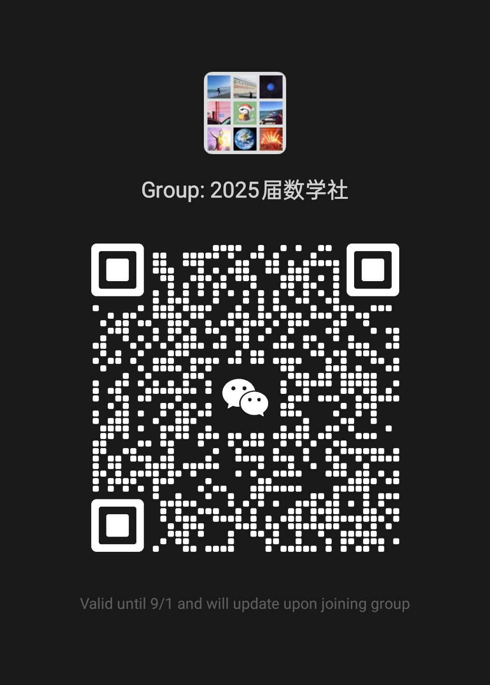

<!--_header: ""-->

# 🧮 平和数学社

## 2025-2026学年招新

---

## 🌟 我们是谁？

数学社不仅仅是刷题的地方！

在这里，数学是：
- 🎨 逻辑的艺术
- 🔍 解谜的快感  
- 💥 思想的碰撞

---

## 🌈 为什么要来数学社？

- 🤝 遇见喜欢"抬杠"的志同道合伙伴
- ✨ 体会"数学原来可以这么好玩！"的快乐
- 🌀 学会用数学的眼睛看世界
- 🎯 收获专属数学人的中二感

> "世界不过是一道待解的方程。"

---

## 📅 我们的活动

- 每周一次的数学讲堂 (高数, 建模, 线代 ......)
- 校内知识辅导
- 竞赛讲解 (AMC/AIME)
- Math Week (数学游戏, 海报展览 ......)

---

## 📍 活动信息

**时间：** 每周一 16:30 - 17:30  
**地点：** A314教室

🧠 带上你的思维和好奇心，  
和我们一起把"难题"变成"乐趣"吧！

<!--
---

# 🧮 2025-2026

## 来平和数学社
## 一起解锁数学的无限可能！

✨ **期待你的加入！** ✨
-->
