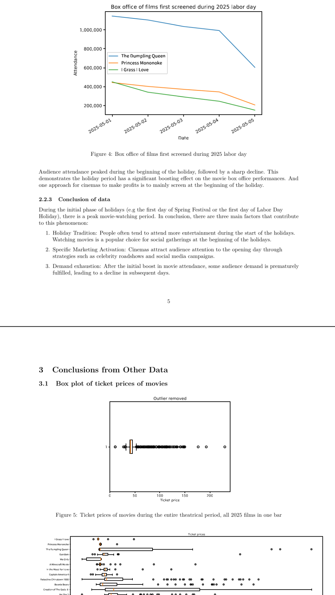

<!--_header: ""-->

# 🧮 平和数学社

## 2025-2026 学年招新

---

## 💡 为什么要来数学社?

- 体验平和最浓厚, 最开放的数学氛围
- 展示你的独特思考, 成为讲师
- 学会用数学建模的角度理解生活中的现象
- 参加丰富的数学社活动, 提升学术能力

---

## 📅 我们的活动

- 每周一次的数学讲堂 (高数, 建模, 线代 ......)
- 校内知识辅导
- 竞赛讲解 (AMC/AIME)
- Math Week (数学游戏, 海报展览 ......)

---

## 🌈 去年的精彩活动

- Math Talk: 关于求 $\frac{1}{1+x^a}$, $a$ 为实数的原创积分技巧 (主讲人的 IA 题目)
- 举办 Integirls Shanghai 数学竞赛并为该竞赛出题

---

## 🎯 今年的期望

- Math Talk 难度分层
	- 降低平均难度, 增加更多人想听的内容
	- 偶尔讲一些更难的内容 (和上个学期大部分差不多)
- 可能会做系列, 一个主题多个讲座, 内容从简单到深入

---

## 📍 活动信息

- 时间: 每周一 16:30 - 17:30
- 地点: A314教室

🧠 带上你的思维和好奇心,
和我们一起把 "难题" 变成 "乐趣" 吧!

---
<!--_header: ""-->

# IB 数学学习内容

## 🧮 平和数学社

---
<!--header: "IB 数学学习内容"-->

## (Pre-)IB 高一数学学习内容

- Sets
- Exponentiation and logarithm
- Quadratic functions
- Series
- Trigonometry and trigonometric functions
- Basic statistics

---

## 数学 IA 例子: 电影院排档期

- 去年高一下学期的第三次月考 + IA
- 给了 20 多部电影的数据, 用统计方法分析电影票房与时间, 类型, 评分等的关系
- 给学校影院排假期中的放映时间表, 最大化利润

